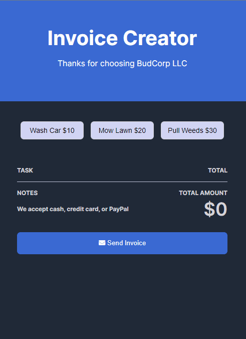

# Invoice Creator

A simple invoice creator that allows a user to select a list of tasks and view the total cost of selected task.



**Link to project** https://invoice-creator-brianbud.netlify.app/

## About Project

The tasks are imported from a separate data file and are displayed as buttons on the page. When a user clicks on a task button, the task is added to a list of selected tasks and the total cost is updated. The user can also remove a task from the selected list by clicking the "remove" button next to the task. The user can then send an invoice for the selected tasks by clicking the "Send Invoice" button. The appearance of the "Send Invoice" button will change depending on whether or not tasks have been selected.

**Tech used:** HTML, CSS, JAVASCRIPT

## Challenges

For the event listener on the `remove` btn, it was my first time using the `.closest()` method which is a method in the JavaScript DOM API that is used to traverse the ancestors of a given element and find the closest element.

Quick start:

```
$ npm install
$ npm start
```
